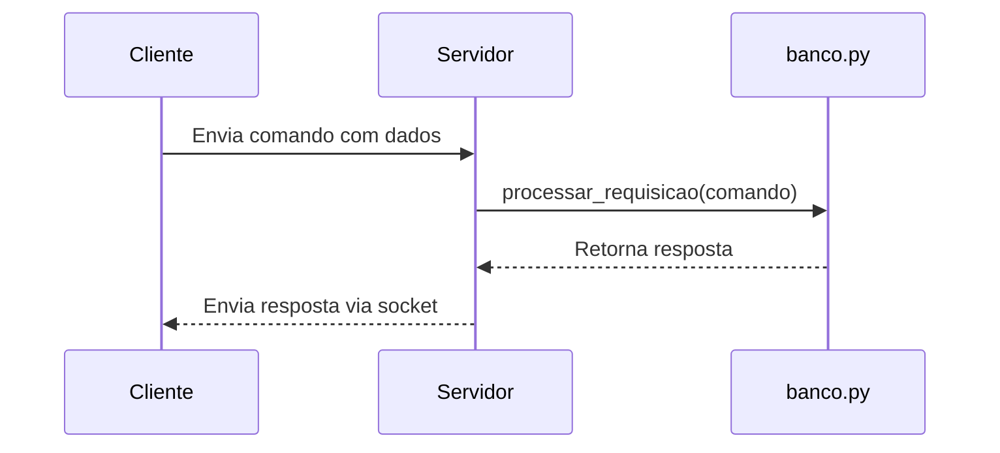

# A3-de-Sistemas-Distribuidos
 <br>

<h1> <b>Sistema de Gerenciamento de Reservas de Mesas com Comunicação Cliente-Servidor em Python</b> </h1>

<h2> <b>Resumo</b> </h2>

Este projeto implementa um sistema de reservas de mesas para um restaurante, utilizando arquitetura cliente-servidor com sockets TCP em Python e banco de dados SQLite. O sistema permite que diferentes tipos de usuários interajam: atendentes podem criar ou cancelar reservas, garçons podem confirmar, e gerentes podem gerar relatórios por mesa, por período ou por garçom.

<h2> <b>Objetivo</b> </h2>

* Desenvolver um sistema distribuído simples.

* Trabalhar com comunicação via sockets.

* Praticar manipulação de banco de dados em SQLite.

* Simular perfis de usuários com diferentes permissões.

<h2> <b>Tecnologias Utilizadas</b> </h2>

|Tecnologia  |Descrição                                 |
|------------|------------------------------------------|
|Python      |Linguagem de programação principal        |
|Sockets TCP |Comunicação entre cliente e servidor      |
|SQLite      |Armazenamento local de dados              |
|VS Code     |Ambiente de desenvolvimento               |

<h2> <b>Estrutura do projeto</b> </h2>

<pre> A3_SD/
├── cliente_atendente/
│ └── cliente_atendente.py
├── cliente_garcom/
│ └── cliente_garcom.py
├── cliente_gerente/
│ └── cliente_gerente.py
├── dataBase/
│ ├── banco.py
│ └── banco.sqlite
├── server/
│ └── servidor.py
|── img/
| └──unifacs-seeklogo.png 
├── README.md </pre>

<h2> <b>Funcionamento do Sistema</b> </h2>

<h3><b>Atendente</b></h3>

* Criar reservas

* Cancelar reservas

* Envia comandos ATENDENTE_CRIAR e ATENDENTE_CANCELAR

<h3><b>Garçom</b></h3>

* Confirmar reservas

* Envia comando GARCOM_CONFIRMAR

<h3><b>Gerentte</b></h3>

* Relatório por mesa

* Relatório por período (datas no formato dd/mm/aaaa)

* Relatório por garçom

* Envia comandos GERENTE_RELATORIO_MESA, GERENTE_RELATORIO_PERIODO e GERENTE_RELATORIO_GARCOM


<h2> <b>Modelo da Tabela no Banco</b> </h2>

|Campo             |Tipo   |Descrição                           |
|------------------|-------|------------------------------------|
|id                |INTEGER|ID da reservas(PK)                  |
|data              |TEXT   |Data da reserva(ISO:yyyy-mm-dd)     |
|hora              |TEXT   |Hora da reserva                     |
|numero_mesa       |INTEGER|Número da mesa                      |
|quantidade_pessoas|INTEGER|Número de pessoas                   |
|nome_resposavel   |TEXT   |Nome da pessoa que fez a reserva    |
|status            |TEXT   |'reservado' ou confirmado           |
|garcom_id         |INTEGER|ID do garçom que confirmou(opcional)|


<h2> <b>Fluxo de Comunicação</b> </h2>

<details>
<summary>📡 Clique e veja como funciona a comunicação</summary>


</details>

<h2> <b>Execução</b> </h2>

<h3><b>1. Iniciar Servidor:</b></h3>

> 💡 Use `python3` no Linux/macOS.  
> 💡 No Windows, o comando pode ser apenas `python`.

```bash
python3 server/servidor.py
```

<h3><b>2. Abrir outro terminal para cada cliente:</b></h3>

```bash
python3 cliente_atendente/cliente_atendente.py
python3 cliente_garcom/cliente_garcom.py
python3 cliente_gerente/cliente_gerente.py
```

